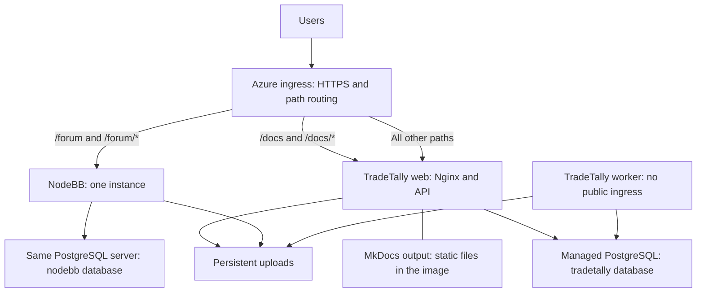

**TradeTally Azure hosting blueprint**

Production provider decision: DigitalOcean was selected on October 8, 2026. The current production plan is [the DigitalOcean hosting blueprint](DIGITALOCEAN_HOSTING_BLUEPRINT.md). This Azure document is retained as a reference for the managed-service alternative and future learning labs.

Planning baseline: October 8, 2026. This document describes a future permanent cutover, rather than an on-prem/cloud failover system. No Azure resources have been provisioned. The database sizes, service memory, and PostgreSQL baseline metrics below were supplied by the operator. The operator reports that the site is mostly unused currently, so representative interactive/import load still needs testing before final sizing. The docs generator is MkDocs; its source repository and build dependencies still need to be identified.

**Current measured footprint**

| Item | Operator-provided measurement | Sizing implication |
| --- | --- | --- |
| TradeTally database | 4.34 GiB; 4,660,804,631 bytes | Fits within the planned 32 GiB allocation |
| Discourse database | 170 MiB; 178,191,383 bytes | Small migration dataset; NodeBB's resulting database size may differ |
| Combined databases | Approximately 4.51 GiB | About 14 percent of 32 GiB, before WAL, temporary files, growth, and maintenance headroom |
| TradeTally backend | 309 MiB excluding PostgreSQL | Supports testing a 1 GiB web allocation; does not establish peak use or the footprint after splitting workers |
| Discourse stack | About 1.65 GiB including PostgreSQL and Redis | Cannot be compared directly with the backend-only TradeTally measurement or used as NodeBB's RAM requirement |
| MkDocs container | 44 MiB | Build static output and remove its dedicated runtime allocation |

| PostgreSQL baseline metric | TradeTally | Discourse |
| --- | ---: | ---: |
| Current working set estimate | 1.58 GiB | 214 MiB |
| Current memory including cache | 3.19 GiB | 335 MiB |
| Recorded memory peak including cache | 3.52 GiB | 490 MiB |
| Average CPU since startup | 8.07 percent of one core | 0.33 percent of one core |
| Average CPU in a 60-second sample | 3.13 percent of one core | 0.25 percent of one core |
| Highest 5-second CPU sample | 5.63 percent of one core | 1.07 percent of one core |

The since-startup windows begin September 30 for TradeTally and September 22 for Discourse. These metrics describe the current mostly-unused baseline; the highest 5-second sample does not establish a historical busy-period peak. Memory including cache is not a hard minimum RAM requirement. The two estimated working sets total about 1.79 GiB, which leaves little room on a 2 GiB managed database for other overhead and bursts. Consolidating two servers changes buffering and overhead, and NodeBB's database workload differs from Discourse's, so this sum is a screening estimate rather than a precise Azure memory requirement.

Database size does not include filesystem uploads. Inventory screenshots, diary attachments, avatars, forum uploads, and backups separately. PostgreSQL need not cache the entire database in RAM, but a small on-disk dataset does not establish that its queries fit a small CPU budget.

**Recommended starting architecture**

Use one Azure region and one Container Apps workload-profiles environment running the Consumption profile. Use default ingress, native path routing, and a managed certificate for tradetally.io. Put PostgreSQL in the same region. Start with one NodeBB instance and one TradeTally worker; allow multiple TradeTally web revisions for deployments and feature testing.

This replaces the site's dependency on OPNsense and its Caddy reverse proxy. Existing public paths remain. Azure manages the network ingress and TLS; application containers still serve their own content. Native path routing is marked generally available in [Microsoft's roadmap](https://github.com/microsoft/azure-container-apps/issues/591). Default ingress proxy compute has no separate billing according to [Microsoft's ingress configuration documentation](https://learn.microsoft.com/en-us/azure/container-apps/ingress-environment-configuration).

If a required Caddy feature cannot be represented in native routing, keep Caddy in a small separate Container App and proxy to application ingress endpoints. That is a fallback with another compute allocation and network hop; the baseline does not require it.

**Routing contract**

Bind tradetally.io to the environment-level HTTP route, rather than independently binding it to each app. Put specific routes before the catch-all. Prefer boundary-aware matches so /forum matches /forum and its descendants, but not /forum-other.

| Public path | Destination | Path handling |
| --- | --- | --- |
| /forum and /forum/* | NodeBB | Preserve /forum |
| /docs and /docs/* | TradeTally Nginx static docs location | Preserve /docs; redirect /docs to /docs/ |
| /api/* | TradeTally web | Preserve path |
| /oauth/* and /.well-known/* | TradeTally web | Preserve existing application behavior |
| All other paths | TradeTally web | Preserve path and SPA navigation |

Use the TradeTally app as the target without pinning the route to a specific revision or label; verify its configured revision weights are honored through the environment route during rehearsal. Configure application ingress to be internal to the environment where possible, exposing the applications through the public route. Give the worker no ingress and no route target. See [custom-domain routing](https://learn.microsoft.com/en-us/azure/container-apps/rule-based-routing-custom-domain).

Set NodeBB's canonical url to https://tradetally.io/forum. Its assets, Socket.IO connections, redirects, and OAuth callback must all include that base path. Do not strip /forum while forwarding to a NodeBB installation configured for /forum. NodeBB documents subfolder operation in its [Caddy proxy guide](https://docs.nodebb.org/configuring/proxies/caddy/).

Test forwarded host/protocol headers and configure TradeTally's proxy trust for the actual Azure hop arrangement. Do not blindly trust arbitrary forwarded headers. Check login cookies, client IP rate limiting, absolute links, WebSocket upgrades, and streaming responses. Preserve current www-to-apex redirection. Configure cookies with distinct names and suitable paths for TradeTally and NodeBB; sharing a hostname does not automatically share login sessions.

**MkDocs hosting**

Build MkDocs in CI, with pinned dependencies and the existing theme/plugins. Include site_url: https://tradetally.io/docs/ in its configuration. Run mkdocs build and copy the generated site contents into /usr/share/nginx/html/docs in the production web image. Python and MkDocs are build-time tools; production serves static HTML, CSS, JavaScript, and search data. [MkDocs deployment documentation](https://www.mkdocs.org/user-guide/deploying-your-docs/) and [configuration documentation](https://www.mkdocs.org/user-guide/configuration/) support this layout.

Add an explicit Nginx /docs/ location before the SPA fallback. Resolve actual docs files and directories; missing documentation pages must return a documentation 404 instead of the TradeTally index.html. Check nested pages, search, canonical links, trailing slashes, theme scripts, and asset URLs under /docs/.

This adds no separately allocated runtime service or docs cold start. The tradeoff is that a docs-only update produces a new web image/revision. Cache docs build artifacts so that this rebuild is inexpensive. Keep the same docs bundle in both active TradeTally revisions during a canary so readers do not receive alternating docs versions.

If independent docs releases later become important, use a tiny static-server Container App and change only the /docs route. Start it at 0.25 vCPU / 0.5 GiB. One warm instance avoids cold starts, at an additional modest compute cost; scaling it to zero trades response time for lower cost.

**Provisional resource sizes**

| Component | Starting allocation | Replica policy |
| --- | --- | --- |
| TradeTally web | 0.5 vCPU / 1 GiB | Min 1, max 3 per revision |
| TradeTally worker | 0.25 vCPU / 0.5 GiB initially | Min 1, max 1 desired instance; raise to 0.5 vCPU / 1 GiB if measured job memory needs it |
| NodeBB | 0.5 vCPU / 1 GiB | Min 1, max 1, single-revision updates |
| MkDocs | Static output in web image | No extra allocation |
| PostgreSQL planning baseline after memory measurements | B2s: 2 vCPU / 4 GiB, 32 GiB storage | One server, separate databases and roles; validate credit behavior |
| PostgreSQL minimum-cost experiment | B1ms: 1 vCPU / 2 GiB, 32 GiB storage | Approve only if a restored-copy test demonstrates adequate memory, latency, and CPU-credit headroom |
| Container registry | ACR Basic | Immutable images |

These are measurement starting points, not claims that the workloads fit. The measured 309 MiB backend footprint supports retaining the 1 GiB web allocation initially rather than prematurely reducing it to 0.5 GiB. Keep NodeBB at 1 GiB until its actual imported forum and plugins are measured; then test 0.25 vCPU / 0.5 GiB as a cost reduction if peak memory and latency permit. Run import/enrichment bursts and realistic concurrent requests. Measure peak memory, p95 response time, worker queue age, database CPU credits, and query latency. Container CPU/memory allocations must use supported combinations.

Min 1 web and forum replicas avoid routine cold starts. A worker polling the PostgreSQL job queue must stay available; HTTP requests are not a dependable trigger to wake a worker with no ingress. Move infrequent scheduled tasks into Container Apps Jobs only after they have one-shot entrypoints and bounded execution. Do not simply scale existing timers to zero.

Max replica counts apply per revision. Two active web revisions can temporarily consume twice the configured capacity. Limit the deployment pipeline to two active production web revisions and deactivate the old one after the observation window. A platform deployment can also briefly overlap worker processes; max 1 is not an exactly-once scheduler guarantee.

**Database and networking**

Use one custom VNet with distinct delegated subnets for the Container Apps environment and PostgreSQL Flexible Server, plus PostgreSQL private DNS. Keep the environment's inbound ingress public while using private network access to the database. Use a workload-profiles environment rather than the legacy Consumption-only environment. See [Container Apps networking](https://learn.microsoft.com/en-us/azure/container-apps/networking).

Use separate tradetally and nodebb databases, runtime credentials, and migration privileges. Sharing a server saves a second server's compute bill but shares CPU, I/O, and failure impact. Keep forum queries away from TradeTally tables. Avoid an extra Redis service initially: a single NodeBB instance with PostgreSQL does not require Redis for clustering.

Configure certificate-validated PostgreSQL TLS. Start connection pools around 10 connections per web process and worker, then measure. Budget against every active revision and instance, plus NodeBB, migration jobs, and operational connections. Enable built-in PgBouncer only if supported by the chosen tier and needed; B1ms/B2s pooling availability must not be assumed.

The additional PostgreSQL working-set estimates make B2s the safer planning baseline. B1ms remains worth testing for cost savings but is no longer justified by database size alone. CPU demand is low in the supplied baseline; the missing evidence is how queries behave with constrained cache and active users. Restore the databases, run representative analytics, imports, enrichment, and forum requests, and monitor latency, memory, connections, and CPU credits over normal busy periods before approving a tier for cutover. B2s offers more memory and burst capacity but is still Burstable. Microsoft positions Burstable primarily for nonproduction workloads; move to General Purpose for sustained production CPU demand and stronger support expectations. General Purpose and high availability require a higher budget. See [compute options](https://learn.microsoft.com/en-us/azure/postgresql/compute-storage/concepts-compute).

Choose region from actual user latency and SKU availability, rather than the RV's changing location. Central US is used below only as a price example. Start with standard networking; add fixed outbound NAT only if an external integration actually requires a stable allowlisted IP. A Container Apps environment private endpoint is distinct from private PostgreSQL networking and can add substantial charges. Do not enable it merely to reach the database.

**TradeTally changes before scaling**

The public checkout was inspected for this plan. SaaS production deployment changes belong in the private tradetally-cloud repository; confirm its actual differences before implementation. Public self-hosted URLs, images, and SMTP behavior remain governed by repository instructions.

1. Provide explicit web and worker startup roles. Web requests enqueue jobs; only workers process them. In this checkout, jobQueue.addJob and addBatchJobs call startProcessing, so DISABLE_BACKGROUND_JOBS=true alone does not enforce that boundary.
2. Move startup migrations, P&L backfills, and schema/data repair ownership out of every web replica. Some deferred repairs run before the background-disable checks. Run required deployment work once with its own entrypoint and compatible runtime privileges.
3. Use scheduler leases/locks and idempotent job effects. Audit recovery and parallel processing ownership. Avoid duplicated broker syncs, emails, and market-data calls during overlapping deployments.
4. Configure PostgreSQL TLS and tune the existing default pool of 50 connections per process.
5. Replace local-only upload persistence with shared storage or an application storage adapter.
6. Audit in-memory analytics invalidation, rate limits, and process-local notifications. A cache invalidation in one instance does not automatically clear another instance's memory. Use shared database state/invalidation where practical before adding infrastructure just for this purpose.
7. Handle termination cleanly. The current image supervises Nginx and a background Node process through a shell; verify signals reach Node and drain work before platform shutdown.
8. Separate liveness from readiness. Readiness checks database access and startup readiness; liveness should not repeatedly restart a healthy process merely because the database is briefly unavailable.
9. Validate long-running imports and AI requests against Azure ingress limits. The existing Nginx 900-second timeout does not extend an upstream platform timeout. Queue long work and return a job identifier; use polling or validated streaming behavior instead of paying for premium ingress just to hold requests open.
10. Make static asset delivery safe across revisions. An HTML page from revision A can request an asset from B. Retain the assets referenced by every active version in a shared versioned asset store or in both active images. Maintain frontend/API compatibility through the rollout.

**Persistent files and backups**

For the first cutover, use separate Azure Files shares for TradeTally and NodeBB uploads if retaining their filesystem APIs minimizes migration work. Mount the necessary writable directories, including any application data that cannot be regenerated. Do not mount application code or node_modules on the file share. Verify UID/permissions, file-operation latency, and upload behavior with the actual images. Container Apps supports [Azure Files mounts](https://learn.microsoft.com/en-us/azure/container-apps/storage-mounts).

Longer term, store TradeTally uploads in private Blob Storage through an application adapter. Blob Storage is object storage, not a drop-in directory mount. Preserve existing access rules for private screenshots/diary images. Do not assume an unverified NodeBB upload plugin supports the selected release; Azure Files is the baseline for its uploads.

Use PostgreSQL managed backups with a chosen retention period and independent logical backups in Blob Storage. Protect uploaded files with backups/versioning appropriate to their storage service. Test restores of both databases and files, and alert on backup age. Replication or storage durability alone does not protect against accidental deletion. A single-region initial deployment accepts outages during some platform or database events; adding HA is a separate cost decision.

**TradeTally and forum CI/CD**

Use GitHub Actions with federated Azure authentication, build images once, push to ACR with commit-SHA tags/digests, and deploy that immutable artifact. Store application secrets in Key Vault and grant narrowly scoped managed identities to retrieve secrets and pull images. Avoid rebuilding different production artifacts after testing.

For TradeTally: run relevant tests; build the web image plus pinned MkDocs output; apply only backward-compatible schema changes once; deploy a candidate revision; verify it through a protected test URL; move traffic from 0 to 5 to 25 to 100 percent based on error rate, latency, and functional checks; then deactivate the previous revision. Worker updates follow separately with a single scheduler owner and job-payload compatibility across versions. Expand/contract database migrations permit application rollback; traffic rollback does not undo database writes or destructive schema changes.

Use account-based flags for consistent feature cohorts. Traffic weights select requests, not a permanent set of users. Do not treat a candidate connected to production data as a safe sandbox; experiments that mutate schemas or data need an isolated test database.

For NodeBB: pin core and plugin versions; back up its database and uploads; test upgrades using a copy; deploy one version with a short maintenance window where necessary. No forum canary or cluster is required. For MkDocs: update the pinned docs artifact, rebuild the web image, and use normal web release checks.

Implement resource definitions in Bicep with parameters for region, sizing, replicas, retention, and budget. Keep cloud production deployment definitions in the private cloud repository. Use temporary test resources that can be removed after rehearsals; do not maintain a duplicate paid production stack merely for this migration.

**Forum migration and OAuth**

The old [Discourse exporter](https://github.com/BenLubar/nodebb-plugin-import-discourse) is archived and tested against a 2018 schema. Its [companion importer](https://github.com/akhoury/nodebb-plugin-import) targets NodeBB 1.12.1. Plan to adapt the mappings into a current import script and prove them against a Discourse backup. Preserve users, authorship, times, categories, topics, posts, uploads, and intended permissions; map old URLs to redirects. Explicitly decide what happens to private messages, trust levels, badges, tags, and other platform-specific features.

Use [NodeBB's OAuth2 Multiple plugin](https://github.com/NodeBB/nodebb-plugin-sso-oauth2-multiple) with a single tradetally strategy. Its current code supports PKCE and the sub/preferred_username/email/email_verified claims returned by this checkout. Register https://tradetally.io/forum/auth/tradetally/callback in a dedicated TradeTally OAuth application, if that is the final NodeBB canonical URL and strategy name. Configure /oauth/authorize, /oauth/token, and /oauth/userinfo on the TradeTally origin; request openid profile email and enable PKCE S256.

Map imported forum accounts to stable TradeTally subjects. Verified-email matching can handle some accounts, but inspect mismatches and duplicates before enabling login. Test one imported user with old posts and one new user. Avatar and role/tier syncing need explicit mapping: TradeTally currently returns avatar_url and role/tier, while this plugin expects picture and a roles array for those optional functions. Do not assume logging out of one application logs out of both.

**Cost model**

These estimates use Central US public pay-as-you-go USD rates queried on October 8, 2026, 730 hours/month, and no commitments. Prices change; confirm the exact region and subscription offer before provisioning. See the [Azure Retail Prices API](https://learn.microsoft.com/en-us/rest/api/cost-management/retail-prices/azure-retail-prices).

| Fixed baseline item | Approximate monthly amount |
| --- | ---: |
| PostgreSQL B1ms compute, if a tiny-load experiment passes | $14.02 |
| PostgreSQL B2s compute, evaluation baseline | $56.09 |
| PostgreSQL 32 GiB storage | $4.16 |
| ACR Basic, approximately 30.4 days | $5.07 |

The database alternatives are mutually exclusive. B2s plus 32 GiB is about $60/month, not $20/month. Allow for growth, excess backup storage, and any selected storage IOPS charges.

For the three baseline apps (web 0.5/1, forum 0.5/1, worker 0.25/0.5), aggregate allocation is 1.25 vCPU and 2.5 GiB. At current rates, it is about $29.57/month if all replicas qualify as idle, or $98.55/month if all remain active for the whole month, before the shared subscription grants. CPU active rate is $0.000024/vCPU-second; CPU idle and memory rates are $0.000003 per allocated unit-second. These endpoints are illustrations, not a promise of either bill.

The subscription includes 180,000 vCPU-seconds, 360,000 GiB-seconds, and 2 million external requests per month across the apps, not separately per app. Idle qualification requires min replicas greater than zero, no HTTP request in progress, and CPU/network activity below the documented thresholds. Polling, WebSocket connections, and background work can cause active billing. See [Container Apps billing](https://learn.microsoft.com/en-us/azure/container-apps/billing).

Working planning envelopes, excluding taxes, external market-data/AI/email services, and high availability:

| Setup | Provisional monthly envelope |
| --- | ---: |
| Measured footprint, if B1ms passes workload validation | Approximately $60–140 |
| B2s alternative with three apps | Approximately $100–180 |
| Larger workers, extra active revisions, General Purpose DB, HA, or substantial egress | Above that range |

These envelopes allow modest uploads/backups and logging; actual dataset size and file-share operations can change them. They are not spending limits. Budget alerts notify; they do not cap spending. Limit logging volume, retain only useful data, set an initial monthly budget alert, and examine per-resource costs after the first week and month. Start with default ingress and no separately paid Front Door, Application Gateway, NAT Gateway, Redis, or permanently running staging database unless a measured requirement warrants one.

Budget B2s based on the newer memory measurements, while testing B1ms on a restored copy to determine whether the approximately $42/month compute saving is practical. A mostly-unused site still incurs the allocated PostgreSQL compute bill. If NodeBB subsequently fits 0.25 vCPU / 0.5 GiB, that reduction saves approximately $5.91/month at continuous idle rates or $19.71/month at continuous active rates before changes to shared grants. Do not count that saving until NodeBB has been measured. Prioritize representative active-user/import tests and application peak measurements over collecting more idle snapshots.

If steady active compute makes Container Apps uneconomic, compare a small Azure VM running Docker/Caddy and managed PostgreSQL using measured resource needs. It may lower the bill but transfers OS patching, process supervision, and rollout routing back to the operator. Container Apps remains the baseline because managed revisions and simpler operations are explicit project goals.

**Implementation and cutover order**

1. Measure the current stack and identify the docs build, cloud repository, storage inventory, DNS provider, and current Caddy routes. Export configuration without exposing secret values.
2. Make web/worker roles, TLS, shared uploads, graceful shutdown, cache invalidation, and multi-revision assets ready. Keep application behavior testable locally.
3. Provision the Azure environment, private PostgreSQL networking, databases, storage, registry, identities, certificate setup, and monitoring through Bicep. Keep production traffic at home.
4. Deploy a restored copy to a temporary test hostname. Validate /docs, /forum, OAuth, trading workflows, uploads, callbacks, worker tasks, streaming, and rollback. Test latency from actual user regions. Confirm certificates can be issued/brought in without an avoidable HTTPS gap during DNS cutover.
5. Complete and verify the forum migration as its own change where practical. Avoid discovering importer errors during the Azure production maintenance window.
6. Lower the relevant DNS TTL in advance. Pause production writes, stop all home workers/schedulers, take final database backups, and synchronize uploads. Put the old public endpoint into maintenance mode so cached DNS clients cannot keep writing there.
7. Restore Azure data, reconcile required secrets/signing/encryption keys, run the intended migrations once, and perform final checks. Retain broker encryption keys, JWT/OAuth keys, and callback URLs where continuity requires them.
8. Switch DNS to the Azure ingress address after HTTPS and readiness are verified. Start the single worker owner and monitor errors, queue delay, database load, OAuth, email, and uploads.
9. Keep home production services stopped and preserve their final backups until the observation period is complete. Once Azure accepts writes, it is authoritative. Roll back code against the Azure database if compatible; moving data back requires a controlled transfer, not a DNS reversal.
10. Right-size from measured peak memory, latency, queue delay, and the first Azure bill. Add capacity or managed services only when they solve a demonstrated problem.

Acceptance evidence should include successful document search under /docs, forum posting/upload/Socket.IO and OAuth under /forum, stable user account linking, representative trade/import/enrichment results, no duplicate scheduled side effects, safe asset delivery across revisions, valid proxy/cookie behavior, a tested database-and-upload restore, and actual monthly-cost projections from observed usage.
