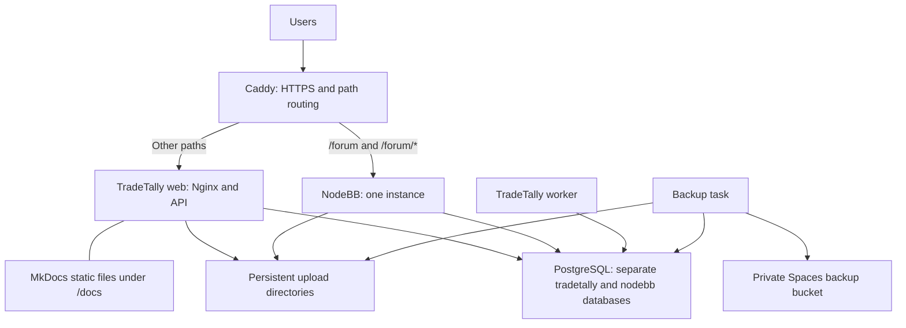

**TradeTally DigitalOcean hosting blueprint**

Provider selected October 8, 2026. This is a future permanent replacement for the home server. No server, subscription, or paid resource has been created. Production should run independently of the owner's RV connection. That connection is used only for administration and development.

**Initial infrastructure and budget**

Start with one Basic Regular Droplet with 8 GiB RAM, 4 shared vCPUs, and 160 GiB SSD storage. Choose a region near the actual users and test latency before cutover. Build images in CI to avoid consuming production memory and CPU during builds.

| Item | Baseline monthly amount |
| --- | ---: |
| Droplet: 8 GiB / 4 shared vCPUs / 160 GiB SSD | $48.00 |
| Weekly Droplet backups: 20 percent of Droplet cost | $9.60 |
| Spaces Standard subscription for database/file backups | $5.00 |
| Private images in GitHub Container Registry | Currently free container storage/bandwidth |
| Baseline total | $62.60 |

Prices are public USD rates checked October 8, 2026. The baseline excludes taxes, domain renewal, external market-data/AI/email services, paid CI usage, transfer/storage overages, and optional monitoring subscriptions. A working hosting budget is approximately $65–75/month with modest usage. Daily Droplet backups instead of weekly cost $14.40/month, making the three paid baseline services $67.40/month. These are alternatives, not charges to add together.

Sources: [Droplet and backup pricing](https://www.digitalocean.com/pricing/droplets), [Spaces pricing](https://docs.digitalocean.com/products/spaces/details/pricing/), and [GitHub Container Registry billing](https://docs.github.com/en/billing/concepts/product-billing/github-packages). Spaces includes 250 GiB of standard storage; retained database dumps and file archives must be counted against that allowance. Recheck prices and available plans before provisioning.

**Architecture and routing**

Use Docker Compose on the Droplet. Keep Caddy, PostgreSQL, NodeBB, the worker, and persistent volumes in a stable infrastructure stack. Manage the current and candidate TradeTally web containers separately so an application deploy does not restart the database or forum.

Caddy replaces the existing OPNsense-hosted proxy and retains its public route behavior. Import and review the actual Caddy configuration before changing it. Route /forum and its descendants to NodeBB without stripping the prefix; configure NodeBB's canonical URL as https://tradetally.io/forum. Forward remaining paths to TradeTally's existing Nginx image, including /api and /oauth. Preserve www-to-apex redirects, forwarded protocol/host information, upload limits, and WebSocket/streaming behavior. Set distinct application cookie names and suitable paths.

Build MkDocs in CI with site_url set to https://tradetally.io/docs/. Copy the site output into /usr/share/nginx/html/docs in the web image. Add an explicit /docs/ Nginx location and redirect /docs to /docs/. Missing docs pages must not return the TradeTally SPA. This removes the dedicated MkDocs runtime service. During web rollouts, use the same docs artifact across the two active versions.

Publish only Caddy's HTTP/HTTPS ports. Keep PostgreSQL and app ports on private Docker networks. Permit key-based SSH only through an appropriate administrative access policy; an RV's changing public IP needs to be accounted for. Docker-published ports must be checked against the provider firewall and actual host firewall behavior. Persist Caddy's certificate state so deployments do not repeatedly request certificates.

**Sizing evidence and performance**

Operator measurements: TradeTally database 4.34 GiB, Discourse database 170 MiB, combined about 4.51 GiB. TradeTally backend memory is 309 MiB excluding PostgreSQL. PostgreSQL working-set estimates are 1.58 GiB for TradeTally and 214 MiB for Discourse; memory including cache is higher. The site is mostly unused currently. See the [Azure comparison document](AZURE_HOSTING_BLUEPRINT.md) for the complete supplied metrics.

Eight GiB is an initial whole-host testing candidate, not a guarantee that every busy workload fits. Measure PostgreSQL, current/candidate web containers, the worker, NodeBB, and the OS together. Leave memory available for the kernel, filesystem cache, and overlapping deployments. Keep memory-heavy job concurrency bounded. Build NodeBB and TradeTally images outside production.

Start with a modest PostgreSQL shared-buffer configuration and conservative per-query memory/connections; tune from measured queries rather than giving the database the entire host's RAM. Share one PostgreSQL server with separate databases, runtime credentials, and migration privileges. Retain the existing PostgreSQL major version for the initial cutover to avoid combining a hosting migration with a database upgrade. No Redis clustering service is required for the single NodeBB instance.

Shared CPU performance can vary. Monitor p95 request latency, PostgreSQL query time, CPU/steal time, memory pressure, disk latency/free space, and worker queue age. Test analytics, imports, enrichment, and forum use together. Keep 160 GiB for the initial disk only if the upload and image inventory fits; the database measurement excludes these files. Rotate logs and prune unused images after preserving rollback artifacts.

If growth requires more memory, resize with a maintenance window and backups. CPU/RAM-only resizing preserves future flexibility; increasing the Droplet's disk is permanent and the disk cannot subsequently shrink. See [DigitalOcean resizing guidance](https://docs.digitalocean.com/products/droplets/how-to/resize/). Split PostgreSQL onto a second VM or consider managed services only when measured usage and operating requirements justify the expense.

**CI/CD and controlled rollouts**

Keep SaaS deployment definitions in the private tradetally-cloud repository. The public self-hosted repo keeps its existing repository URLs, Docker image identity, and SMTP-only email behavior.

Use GitHub Actions to run relevant tests, build immutable web/worker images and the pinned MkDocs bundle, and push commit-SHA-tagged images to private GHCR packages. Give the server read-only image-pull credentials. Use a restricted deployment identity and an audited server-side deployment script. Secrets belong in protected server files or an appropriate secret manager, not images, repository files, or command output. Serialize production deployment jobs.

The release procedure is:

1. Check disk/memory headroom, take the required database backup, and run compatible migrations once.
2. Start a candidate TradeTally web container alongside the current one with migrations and background processing disabled by its application role.
3. Test the candidate through protected routing, then configure Caddy's application routing for a controlled rollout.
4. Observe error rate, latency, authentication, and representative trading workflows. Increase traffic only when checks pass.
5. Keep the previous image/configuration available for rollback, then remove its running container after the observation window.

Implement and test the chosen Caddy routing mechanism before relying on percentage distribution. Account-based feature flags provide stable test cohorts; request weighting alone does not. Preserve assets referenced by every active frontend version so an asset request landing on the other container still works. Keep old/new API contracts, schema, and worker job payloads compatible. Rolling back code does not undo database writes.

TradeTally requires real web/worker separation: in the inspected checkout, enqueueing jobs can start processing in the web process, and some startup repairs run independently of the background-disable flag. Move those duties to explicit deployment/worker entrypoints. Give schedulers a single logical owner using leases/locks; make side effects idempotent during restarts or overlapping worker deployments. Audit shared cache invalidation and process-local notifications before running multiple web instances. Existing Docker startup also needs signal-forwarding and graceful-shutdown verification.

Update NodeBB normally using pinned core/plugin versions, database/upload backups, and a maintenance window when its upgrade requires one. No forum A/B routing is planned. Start with Docker log rotation and lightweight health/metrics collection; add a larger logging platform only if it solves a demonstrated need.

**Data persistence, recovery, and forum identity**

Keep PostgreSQL data and application uploads in stable named volumes or explicit host directories outside replaceable containers. Use separate upload locations for TradeTally and NodeBB. Never delete persistent volumes as part of an application deployment. Protect private screenshots and diary attachments through the existing application authorization.

Combine provider VM backups with encrypted database-native backups and file backups to a private Spaces bucket. Provider images are not a substitute for a tested PostgreSQL restore. Keep dated backups with a defined retention policy, verify checksums, alert on age/failures, and rehearse restoring both databases and uploads onto a replacement Droplet. Choose the backup interval from acceptable data loss; nightly dumps imply roughly a day's potential loss. Add more frequent backups or WAL-based recovery if that is unacceptable.

Use the established Discourse import mappings as a starting point for a current migration script. Old importer plugins target obsolete versions, so rehearse against a backup before committing. Preserve authorship, timestamps, uploads, category permissions, and old-topic redirects. Explicitly decide which Discourse-specific features to retain or retire.

Configure NodeBB's OAuth2 Multiple plugin with one tradetally provider, PKCE S256, scopes openid profile email, and the existing TradeTally /oauth endpoints. Register the exact final callback URL, expected to be https://tradetally.io/forum/auth/tradetally/callback for that strategy/base path. Link imported users to stable TradeTally subjects; verify email-based matching and handle exceptions before enabling public login. Validate one imported account with existing posts and one new account.

One VM is one failure domain. Recovery means rebuilding/restoring cloud infrastructure; it does not depend on keeping the home server. The owner remains responsible for OS/container/database upgrades, backup verification, and software monitoring. Automate routine work and document remote recovery so it is manageable while travelling.

**Implementation sequence**

1. Inventory current Caddy routes, upload sizes, docs dependencies, cloud-production repository configuration, and required secrets/callbacks.
2. Prepare web/worker roles, migration ownership, safe assets, graceful shutdown, and deployment scripts locally. Make the Docker Compose design reproducible.
3. Provision the selected Droplet, provider firewall, backup plan, and private backup bucket only when the user requests implementation. Set up accounts, Docker/Caddy, protected secrets, and monitoring.
4. Restore a production copy on a temporary test hostname. Test whole-host peak memory and latency, uploads, MkDocs search, forum WebSockets/OAuth, broker connectivity, background tasks, rollback, and a full restore.
5. Complete the forum migration separately where practical. Retain Discourse backups and URL mappings.
6. Before cutover, lower DNS TTL. Pause home-server writes, stop home workers, take final consistent backups, and synchronize files. Keep the old public endpoint in maintenance mode for clients with cached DNS.
7. Restore final data on DigitalOcean, run intended migrations once, verify Caddy certificates and readiness, and switch DNS. Preserve encryption/signing keys where session and broker-token continuity requires them.
8. Start one worker owner and observe errors, queues, database load, storage, OAuth, and email. Once the Droplet accepts production writes, it is authoritative.
9. Keep final backups through the observation period and retire the home server after recovery has been proven. Revisit sizing from actual bills and active workloads.

Azure remains available for separate learning labs. Give each lab a disposable resource group and remove billable resources when the exercise ends; retain configuration in code so the lab can be recreated. Production availability and learning experiments should have independent lifecycles.
